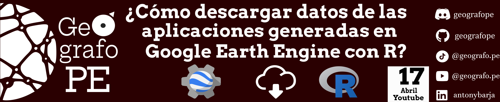

Este repositorio 🗂️ contiene una serie de pasos de como obtener la información disponible en las aplicaciones de `Google Earth Engine` usando el lenguaje de programación de `R`. 

Para este video usaremos las siguientes herramientas:

- [rgee](https://github.com/r-spatial/rgee): Paquete de R que permite trabajar con la API de Google Earth Engine.
- [terra](https://github.com/rspatial/terra): Paquete de R que permite manipular y visualizar datos de tipo raster.
- [QGIS](https://www.qgis.org/): Software de Sistema de Información Geográfica libre y de código abierto que permite manipular, editar, analizar y visualizar datos espaciales.
- [Positron](https://github.com/posit-dev/positron): Interfaz de Desarrollo Integrado para ciencia de datos.

## ⚫ Pasos a realizar 

1. Primer paso: Obtener el archivo `JSON` de la aplicación de `Google Earth Engine`.
   - Para este ejemplo usaremos la aplicación generada por Moat et al. (2021)
     - Link de la aplicación: https://gistin.users.earthengine.app/view/fogoasis
     - Link del paper: https://www.sciencedirect.com/science/article/pii/S0303243421001756 
  
2. Segundo paso: Obtener la dirección del proyecto o repositorio de la aplicación de `Google Earth Engine` donde está almacenada la información ya sea en un  `FeatureCollection`, `Image` o `ImageCollection`.

3. Tercer paso: Usar el paquete `rgee` y `terra` para la extracción de datos ([script](https://github.com/geografope/descargar-datos-de-earthengineapps-con-r/blob/main/script/main.R)).

4. Cuarto paso: Visualizar los datos obtenidos en `QGIS`

Todo el proceso desarrollado esta explicado al detalle en el siguiente video de YouTube 🎥.

¡Enteráte más y aprender conmigo! 🔍💡 Suscríbete, activa las notificaciones 🔔 y únete a la comunidad que ama el software libre de código abierto. 🌟🌍 👇
- https://www.youtube.com/@geografope

- https://www.tiktok.com/@geografope

- https://www.linkedin.com/in/antonybarja/

## ⚫ Referencias:
 - https://r-spatial.github.io/rgee/
 - https://rspatial.github.io/terra/reference/terra-package.html